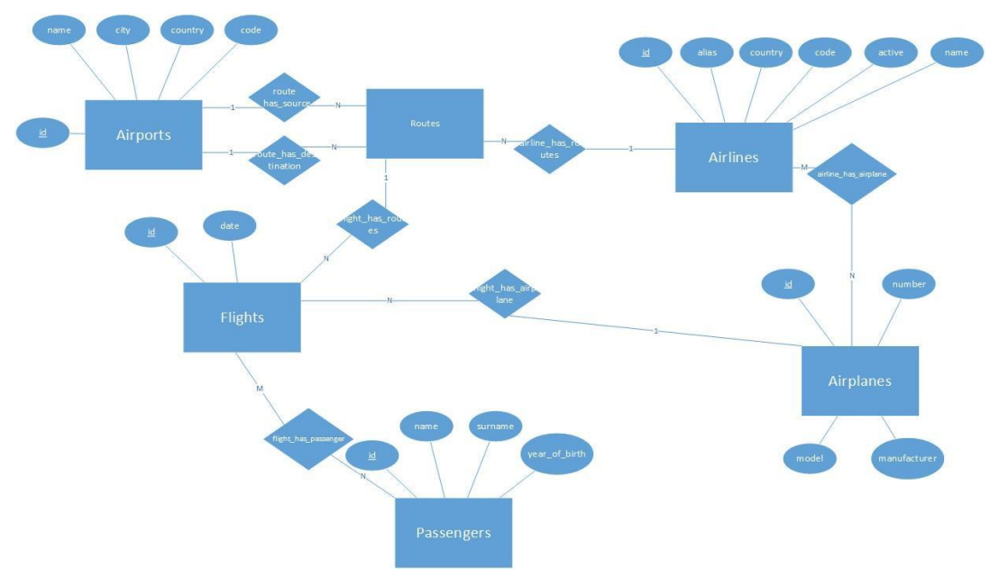
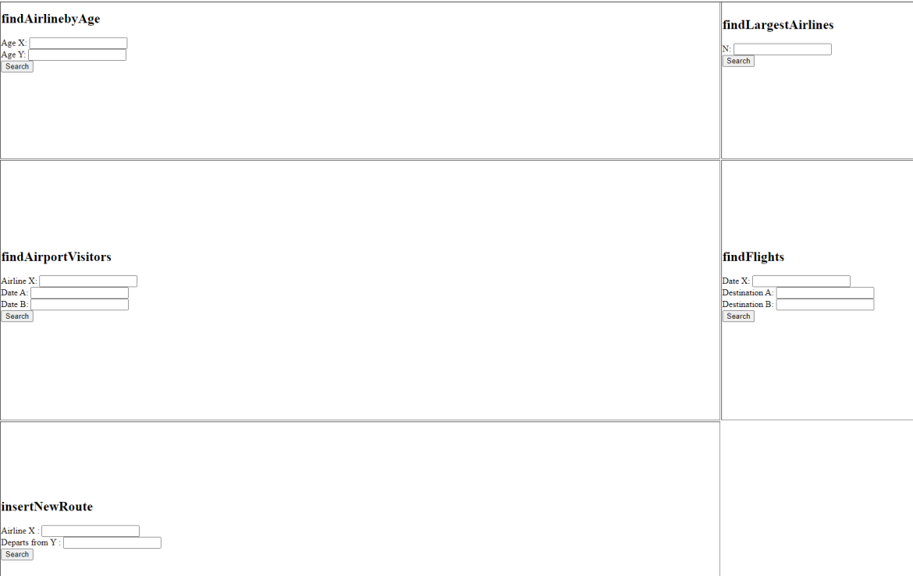

---
# Flight Website implemented in Python and SQL
Here you will find a 3-tier '''Database Manipulation''' application consisting of: web-based UI using '''bottle''' framework, logic application implemented in '''Python''' and database in '''MySQL'''. 

## Content
-Python and SQL 
-Setting up Python environment and MySQL Server
-Connecting to MySQL Server in Python
-Reading Flight Database Data
-Updating Records
-Deleting Records
-Creating Records from Python Lists
-Creating re-usable functions to do all of this for us in the future
-Printing desired Output given user Input

## Functions
1. __findAirlinebyAge__: Find the airline with the most travelers by age
less than X and greater than Y
2. __findAirportVisitors__: Find the total visitors per airport which airline X operates routes between dates A and B. The results should be sorted based on the number of visitors
3. __findFlights__: A passenger wants to travel from city A to city B. Show all alternative flights (and only for active airlines) that may use if he wishes to reach his destination on date X (year-month-day)
4. __findLargestAirlines__: What are the N airlines with the most flights? Accepts an integer N and returns the name, password, and number of aircraft and the flights each one performs.
5. __insertNewRoute__: An airline X (of your choice) decides to add a new route (flight) departing from airport Y (of your choice) to a destination for which it does not yet have routes. This function accepts as input the alternative name of the airline and the full name of the airport and if it finds a destination for which Company X does not have a route, it creates one tuple with the necessary fields (airlines_id, source_id, destination_id), adds to the Flights Database given the company's new route and returns OK. Otherwise it returns the "airline capacity full" error message.

## Future work
☑️ __Make a more appealing and user-friendly web-UI__. ☑️
☑️ __Enhance functionality__. ☑️

This project was made in collaboration with [@gzorpidis].

---

© Giannis Kotsias | 2022